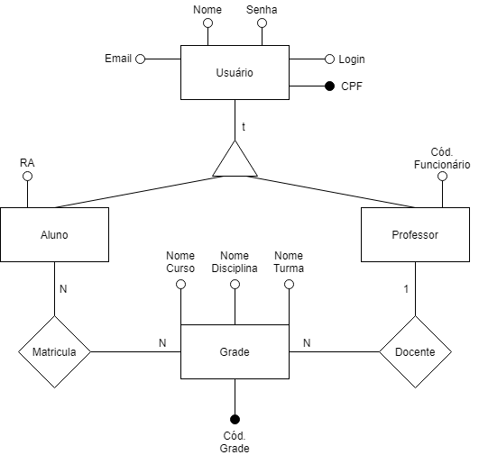

# Desafio para Desenvolvedor(a) de Software – Anima Digital

O desafio descrito nesse documento tem o intuito de avaliar as competências técnicas dos candidatos à vaga de Desenvolvedor(a) de Software. O teste é único para todos os níveis do cargo. Leia com atenção todas as instruções do desafio, a interpretação das informações também faz parte da avaliação.
O projeto consiste em:

* Construção do banco de dados em SQLServer com base no diagrama proposto;
* Criação das APIs de cadastro, remoção e consulta das entidades listadas no desafio;
* Desenvolvimento do processo de agrupamento de alunos e cálculo do salário do professor.

Requisitos obrigatórios:

* Entregar em uma pasta compactada o código fonte do projeto e o script de criação do banco, tabelas e consultas;
* Esperamos também um passo a passo de como executar a sua solução. Quanto mais simples, melhor. Vale ressaltar que a execução **não poderá depender do uso de alguma IDE específica**;
* Utilizar os mesmos nomes de variáveis e caminhos propostos na área de endpoint para facilitar a avaliação.

Utilize o máximo possível de conceitos relacionados a orientação a objeto, design patterns, padrões de arquitetura de software, tratamento de erros, testes de unidade e integrados, “clean code” e demais ferramentas que considere importantes no dia a dia. A utilização desses itens é parte da avaliação, porém não é obrigatória. Tente utilizar o mínimo possível de recursos (bibliotecas) externas, dando preferência as nativas do .NET.

A sua solução será submetida a uma bateria de testes de carga e comportamento pré-definidos e avaliada por um time de desenvolvedores da Anima Digital com base na execução e na utilização das técnicas mencionadas no parágrafo anterior.

O prazo para realizar a atividade é de 5 dias corridos a partir do envio do e-mail. Caso precise de mais tempo, não se preocupe, entre em contato conosco.

Boa sorte no desafio, esperamos que se divirta codificando, estamos disponíveis para qualquer eventual dúvida.

## Banco de Dados
Utilizando o banco SQLServer, crie uma base dados utilizando o MER abaixo como referência.



## Endpoints
Crie os métodos abaixo utilizando **obrigatoriamente** os respectivos exemplos de requests (atente-se ao nome das variáveis e ao endpoint). O response para as funções será definido por você e faz parte da avaliação.

1. Cadastrar aluno  
    POST  
    https://localhost:9000/school/aluno

    BODY
    ```json
    {
        "nome": "João da Silva",
        "cpf": "15358646051",
        "login": "joao.silva",
        "senha": "123",
        "email": "joao.silva@anima.com.br",
        "ra": 1360523
    }
    ```

2. Cadastrar professor  
    POST  
    https://localhost:9000/school/professor

    BODY
    ```json
    {
        "nome": "Maria Souza",
        "cpf": "02854623002",
        "login": "maria.souza",
        "senha": "456",
        "email": "maria.souza@anima.com.br",
        "codigo": 8055608
    }
    ```

3. Cadastrar grade  
    POST  
    https://localhost:9000/school/grade

    BODY
    ```json
    {
        "codGrade": 1,
        "turma": "ABC-123",
        "disciplina": "Lógica de Programação",
        "curso": "Análise e Desenvolvimento de Sistemas",
        "codFuncionario": 8055608
    }
    ```

4. Matricular aluno na grade  
    POST  
    https://localhost:9000/school/matricula

    BODY
    ```json
    {
        "codGrade": 1,
        "ra": 1360523
    }
    ```

5. Desmatricular aluno na grade  
    DELETE  
    https://localhost:9000/school/matricula 

    BODY
    ```json
    {
        "codGrade": 1,
        "ra": 8055608
    }
    ```

## Agrupamento de Alunos

Por motivos de distribuição espacial, uma determinada grade só pode possuir até 10 alunos. Caso ultrapasse esse número, você deve criar uma subdivisão dessa grade de forma transparente. O usuário deve continuar com a possibilidade de cadastrar alunos com o código da grade, mas em segundo plano você deve salvar como uma entidade grade diferente (para eventuais consultas e cálculo de salário, deve-se considerar duas grades).

## Cálculo de Salário

O professor recebe um salário base (R$ 1.200,00) e um bônus calculado a partir do número de grades e quantidade de alunos que ele é responsável. O coeficiente do acréscimo é um produto da quantidade total de alunos dividido pelo número máximo de alunos possíveis em uma grade e multiplicado pelo número de grades do professor. Após obtido o coeficiente deve-se multiplicar pelo valor base do bônus (R$ 50,00) e somar ao piso salarial. Use como base a formula a seguir: 

```S = (TA / 10 * NG) * 50 + 1200```

Onde:  
```TA``` = quantidade total de alunos nas grades ministradas pelo professor.  
```NG``` = número total de grades associadas ao professor.

## Consultas

Crie os métodos abaixo utilizando **obrigatoriamente** os respectivos exemplos de response (atente-se ao nome das variáveis e ao endpoint).

1. Informações da grade  
    GET  
    https://localhost:9000/school/grade?codGrade=1

    RESPONSE
    ```json
    {
        "codGrade": 1,
        "turma": "ABC-123",
        "disciplina": "Lógica de Programação",
        "curso": "Análise e Desenvolvimento de Sistemas",
        "codFuncionario": 8055608,
        "nomeProfessor": "Maria Souza",
        "cpfProfessor": "02854623002",
        "emailProfessor": "maria.souza@anima.com.br",
        "alunos":
        [
            {
                "nome": "João da Silva",
                "ra": 1360523,
                "email": "joao.silva@anima.com.br",    
            },
            {
                "nome": "José Oliveira",
                "ra": 1452691,
                "email": "jose.oliveira@anima.com.br",    
            }
        ]
    }
    ```

2. Salário do professor  
    GET  
    https://localhost:9000/school/professor?cpf=02854623002

    RESPONSE
    ```json
    {
        "codFuncionario": 8055608,
        "nome": "Maria Souza",
        "cpf": "02854623002",
        "email": "maria.souza@anima.com.br",
        "totalGrades": 4,
        "totalAlunos": 10,
        "salario": 1400
    }
    ```
